# 🔐 Authentication Sistemi

Bu dokümantasyon, Clinikoop platformunun kimlik doğrulama ve yetkilendirme sistemini detaylı olarak açıklar.

## 📋 İçindekiler

- [Genel Bakış](#genel-bakış)
- [Mevcut Durum](#mevcut-durum)
- [Güvenlik Sorunları](#güvenlik-sorunları)
- [Çözüm Önerileri](#çözüm-önerileri)
- [Authentication Flow](#authentication-flow)
- [Role-Based Access Control](#role-based-access-control)
- [Session Management](#session-management)
- [Password Security](#password-security)
- [API Security](#api-security)
- [Implementation Guide](#implementation-guide)

## 🌐 Genel Bakış

Clinikoop, multi-tenant bir SaaS platformu olduğu için authentication sistemi karmaşık gereksinimlere sahiptir:

### Authentication Gereksinimleri
- **Multi-tenant support** - Klinik bazlı izolasyon
- **Role-based access** - Farklı kullanıcı rolleri
- **Secure session management** - Güvenli oturum yönetimi
- **Password security** - Güçlü şifre politikaları
- **Password reset** - Şifre sıfırlama
- **Remember me** - Beni hatırla özelliği

### Kullanıcı Tipleri
- **SUPER_ADMIN** - Sistem yöneticisi
- **ADMIN** - Klinik yöneticisi
- **SALES** - Satış personeli
- **DOCTOR** - Doktor
- **ASSISTANT** - Asistan

## ⚠️ Mevcut Durum

### Mevcut Authentication Yapısı

#### 1. İki Farklı Login Sistemi
```typescript
// 1. NextAuth.js (admin-login)
// src/lib/authOptions.ts
export const authOptions: NextAuthOptions = {
  providers: [CredentialsProvider],
  // ...
}

// 2. Custom API Route (/api/auth/login)
// src/app/api/auth/login/route.ts
export async function POST(request: NextRequest) {
  // Custom login logic
}
```

#### 2. Login Sayfaları
```typescript
// Admin Login
// src/app/admin-login/page.tsx
// Süper admin girişi için

// Klinik Login  
// src/app/login/page.tsx
// Klinik kullanıcıları için
```

#### 3. Middleware
```typescript
// src/middleware.ts
// Sadece subdomain routing
// Authentication kontrolü YOK
```

### Mevcut Sorunlar

#### 🔴 Kritik Güvenlik Sorunları
```typescript
// 1. Hardcoded Password
if (credentials.email === user.email && credentials.password === "superadmin123") {
  // ❌ PRODUCTION'DA TEHLİKELİ
}

// 2. Development-Only Logic
// User modelinde password yok, sadece email kontrolü
// ❌ PRODUCTION'DA GÜVENLİK AÇIĞI

// 3. İki Farklı Auth Sistemi
// ❌ KARMAŞIK VE GÜVENSİZ
```

#### 🟡 Architecture Sorunları
```typescript
// 1. Karışık Routing
/admin-login  // Admin için
/login        // Klinik için
// ❌ KARMAŞIK USER EXPERIENCE

// 2. Middleware Eksik
// ❌ AUTHENTICATION KONTROLÜ YOK

// 3. Role-Based Routing Eksik
// ❌ YETKİ KONTROLÜ YOK
```

## 🚨 Güvenlik Sorunları

### 1. Hardcoded Credentials
```typescript
// ❌ YANLIŞ - Production'da tehlikeli
if (credentials.password === "superadmin123") {
  return user;
}

// ✅ DOĞRU - Environment variable kullan
const adminPassword = process.env.SUPER_ADMIN_PASSWORD;
if (credentials.password === adminPassword) {
  return user;
}
```

### 2. Weak Password Validation
```typescript
// ❌ YANLIŞ - Şifre kontrolü yok
const user = await prisma.user.findUnique({
  where: { email: credentials.email }
});

// ✅ DOĞRU - Güçlü şifre kontrolü
const passwordRegex = /^(?=.*[a-z])(?=.*[A-Z])(?=.*\d)(?=.*[@$!%*?&])[A-Za-z\d@$!%*?&]{8,}$/;
if (!passwordRegex.test(password)) {
  throw new Error('Şifre çok zayıf');
}
```

### 3. Session Security Issues
```typescript
// ❌ YANLIŞ - Session timeout yok
session: {
  strategy: "jwt",
  maxAge: 30 * 24 * 60 * 60, // 30 gün - ÇOK UZUN
}

// ✅ DOĞRU - Kısa session timeout
session: {
  strategy: "jwt", 
  maxAge: 8 * 60 * 60, // 8 saat
}
```

### 4. Missing Rate Limiting
```typescript
// ❌ YANLIŞ - Rate limiting yok
export async function POST(request: NextRequest) {
  // Login logic without rate limiting
}

// ✅ DOĞRU - Rate limiting ekle
import rateLimit from 'express-rate-limit';

const loginLimiter = rateLimit({
  windowMs: 15 * 60 * 1000, // 15 dakika
  max: 5, // 5 deneme
  message: 'Çok fazla deneme, lütfen bekleyin'
});
```

## 💡 Çözüm Önerileri

### 1. Unified Authentication System

#### Tek Login Sistemi
```typescript
// src/lib/auth.ts - Unified authentication
export class AuthService {
  static async login(email: string, password: string) {
    // 1. Rate limiting kontrol
    // 2. Input validation
    // 3. User lookup (User + ClinicUser)
    // 4. Password verification
    // 5. Session creation
    // 6. Role-based redirect
  }
}
```

#### Tek Login Sayfası
```typescript
// src/app/auth/login/page.tsx
export default function LoginPage() {
  // 1. Email/Password form
  // 2. Remember me checkbox
  // 3. Forgot password link
  // 4. Role-based redirect
  // 5. Error handling
}
```

### 2. Enhanced Security

#### Password Security
```typescript
// src/lib/password.ts
export class PasswordService {
  static validate(password: string): boolean {
    const minLength = 8;
    const hasUpperCase = /[A-Z]/.test(password);
    const hasLowerCase = /[a-z]/.test(password);
    const hasNumbers = /\d/.test(password);
    const hasSpecialChar = /[@$!%*?&]/.test(password);
    
    return password.length >= minLength && 
           hasUpperCase && 
           hasLowerCase && 
           hasNumbers && 
           hasSpecialChar;
  }
  
  static async hash(password: string): Promise<string> {
    return bcrypt.hash(password, 12);
  }
  
  static async verify(password: string, hash: string): Promise<boolean> {
    return bcrypt.compare(password, hash);
  }
}
```

#### Rate Limiting
```typescript
// src/lib/rate-limit.ts
export class RateLimitService {
  static async checkLoginAttempts(ip: string): Promise<boolean> {
    const key = `login:${ip}`;
    const attempts = await redis.get(key);
    
    if (attempts && parseInt(attempts) >= 5) {
      return false; // Blocked
    }
    
    await redis.incr(key);
    await redis.expire(key, 900); // 15 minutes
    return true;
  }
}
```

### 3. Role-Based Access Control

#### Middleware Enhancement
```typescript
// src/middleware.ts
export function middleware(request: NextRequest) {
  const { pathname } = request.nextUrl;
  
  // 1. Subdomain routing
  const subdomain = extractSubdomain(request);
  
  // 2. Authentication check
  const session = await getServerSession(authOptions);
  
  // 3. Role-based access control
  if (pathname.startsWith('/admin')) {
    if (!session?.user?.isSuperAdmin) {
      return NextResponse.redirect(new URL('/unauthorized', request.url));
    }
  }
  
  // 4. Clinic-based access control
  if (pathname.startsWith('/site')) {
    if (!session?.user?.clinicId) {
      return NextResponse.redirect(new URL('/login', request.url));
    }
  }
}
```

## 🔄 Authentication Flow

### 1. Login Flow

```mermaid
graph TD
    A[Kullanıcı Login Sayfası] --> B[Email/Password Gir]
    B --> C[Input Validation]
    C --> D[Rate Limiting Check]
    D --> E[User Lookup]
    E --> F{User Type?}
    F -->|SUPER_ADMIN| G[User Table]
    F -->|CLINIC_USER| H[ClinicUser Table]
    G --> I[Password Verification]
    H --> I
    I --> J{Valid Password?}
    J -->|Yes| K[Create Session]
    J -->|No| L[Error Message]
    K --> M[Role-Based Redirect]
    L --> A
    M --> N[Admin Dashboard]
    M --> O[Clinic Dashboard]
```


### 2. Session Management
```typescript
// Session creation
const session = {
  id: user.id,
  email: user.email,
  name: user.name,
  role: user.role,
  clinicId: user.clinicId,
  clinic: user.clinic,
  isSuperAdmin: user.role === 'SUPER_ADMIN',
  permissions: user.permissions,
  lastActivity: new Date(),
  expiresAt: new Date(Date.now() + 8 * 60 * 60 * 1000) // 8 hours
};
```

### 3. Logout Flow
```typescript
// src/app/api/auth/logout/route.ts
export async function POST(request: NextRequest) {
  const session = await getServerSession(authOptions);
  
  if (session) {
    // 1. Clear session
    await prisma.session.delete({
      where: { id: session.id }
    });
    
    // 2. Clear cookies
    const response = NextResponse.json({ message: 'Logged out' });
    response.cookies.delete('next-auth.session-token');
    response.cookies.delete('__Secure-next-auth.session-token');
    
    return response;
  }
  
  return NextResponse.json({ message: 'No active session' });
}
```

## 🛡️ Role-Based Access Control

### 1. Permission System
```typescript
// src/lib/permissions.ts
export const PERMISSIONS = {
  // User Management
  USER_CREATE: 'user:create',
  USER_READ: 'user:read',
  USER_UPDATE: 'user:update',
  USER_DELETE: 'user:delete',
  
  // Clinic Management
  CLINIC_CREATE: 'clinic:create',
  CLINIC_READ: 'clinic:read',
  CLINIC_UPDATE: 'clinic:update',
  CLINIC_DELETE: 'clinic:delete',
  
  // Patient Management
  PATIENT_CREATE: 'patient:create',
  PATIENT_READ: 'patient:read',
  PATIENT_UPDATE: 'patient:update',
  PATIENT_DELETE: 'patient:delete',
  
  // Offer Management
  OFFER_CREATE: 'offer:create',
  OFFER_READ: 'offer:read',
  OFFER_UPDATE: 'offer:update',
  OFFER_DELETE: 'offer:delete',
  
  // Support Management
  SUPPORT_CREATE: 'support:create',
  SUPPORT_READ: 'support:read',
  SUPPORT_UPDATE: 'support:update',
  SUPPORT_DELETE: 'support:delete',
  
  // Analytics
  ANALYTICS_READ: 'analytics:read',
  ANALYTICS_EXPORT: 'analytics:export',
  
  // System Settings
  SETTINGS_READ: 'settings:read',
  SETTINGS_UPDATE: 'settings:update',
} as const;

export const ROLE_PERMISSIONS = {
  SUPER_ADMIN: Object.values(PERMISSIONS),
  ADMIN: [
    PERMISSIONS.USER_READ,
    PERMISSIONS.PATIENT_CREATE,
    PERMISSIONS.PATIENT_READ,
    PERMISSIONS.PATIENT_UPDATE,
    PERMISSIONS.OFFER_CREATE,
    PERMISSIONS.OFFER_READ,
    PERMISSIONS.OFFER_UPDATE,
    PERMISSIONS.SUPPORT_CREATE,
    PERMISSIONS.SUPPORT_READ,
    PERMISSIONS.ANALYTICS_READ,
    PERMISSIONS.SETTINGS_READ,
  ],
  SALES: [
    PERMISSIONS.PATIENT_READ,
    PERMISSIONS.OFFER_CREATE,
    PERMISSIONS.OFFER_READ,
    PERMISSIONS.OFFER_UPDATE,
    PERMISSIONS.SUPPORT_CREATE,
    PERMISSIONS.SUPPORT_READ,
  ],
  DOCTOR: [
    PERMISSIONS.PATIENT_READ,
    PERMISSIONS.PATIENT_UPDATE,
    PERMISSIONS.OFFER_READ,
    PERMISSIONS.SUPPORT_CREATE,
    PERMISSIONS.SUPPORT_READ,
  ],
  ASSISTANT: [
    PERMISSIONS.PATIENT_READ,
    PERMISSIONS.OFFER_READ,
    PERMISSIONS.SUPPORT_CREATE,
    PERMISSIONS.SUPPORT_READ,
  ],
} as const;
```

### 2. Permission Check Hook
```typescript
// src/hooks/usePermissions.ts
export function usePermissions() {
  const { data: session } = useSession();
  
  const hasPermission = useCallback((permission: string) => {
    if (!session?.user) return false;
    
    const userPermissions = session.user.permissions || [];
    return userPermissions.includes(permission);
  }, [session]);
  
  const hasAnyPermission = useCallback((permissions: string[]) => {
    return permissions.some(permission => hasPermission(permission));
  }, [hasPermission]);
  
  const hasAllPermissions = useCallback((permissions: string[]) => {
    return permissions.every(permission => hasPermission(permission));
  }, [hasPermission]);
  
  return {
    hasPermission,
    hasAnyPermission,
    hasAllPermissions,
    user: session?.user,
  };
}
```

### 3. Protected Component
```typescript
// src/components/ProtectedComponent.tsx
interface ProtectedComponentProps {
  children: React.ReactNode;
  permission?: string;
  permissions?: string[];
  requireAll?: boolean;
  fallback?: React.ReactNode;
}

export function ProtectedComponent({
  children,
  permission,
  permissions,
  requireAll = false,
  fallback = null
}: ProtectedComponentProps) {
  const { hasPermission, hasAnyPermission, hasAllPermissions } = usePermissions();
  
  let hasAccess = true;
  
  if (permission) {
    hasAccess = hasPermission(permission);
  } else if (permissions) {
    hasAccess = requireAll 
      ? hasAllPermissions(permissions)
      : hasAnyPermission(permissions);
  }
  
  if (!hasAccess) {
    return fallback;
  }
  
  return <>{children}</>;
}
```

## 🔐 Session Management

### 1. Session Configuration
```typescript
// src/lib/authOptions.ts
export const authOptions: NextAuthOptions = {
  providers: [CredentialsProvider],
  session: {
    strategy: "jwt",
    maxAge: 8 * 60 * 60, // 8 hours
  },
  jwt: {
    maxAge: 8 * 60 * 60, // 8 hours
  },
  callbacks: {
    async jwt({ token, user }) {
      if (user) {
        token.role = user.role;
        token.clinicId = user.clinicId;
        token.clinic = user.clinic;
        token.permissions = user.permissions;
        token.isSuperAdmin = user.role === 'SUPER_ADMIN';
      }
      return token;
    },
    async session({ session, token }) {
      if (token && session.user) {
        session.user.id = token.sub!;
        session.user.role = token.role as string;
        session.user.clinicId = token.clinicId as string;
        session.user.clinic = token.clinic as any;
        session.user.permissions = token.permissions as string[];
        session.user.isSuperAdmin = token.isSuperAdmin as boolean;
      }
      return session;
    }
  },
  pages: {
    signIn: "/auth/login",
    error: "/auth/error",
  },
  secret: process.env.NEXTAUTH_SECRET,
  debug: process.env.NODE_ENV === "development",
};
```

### 2. Session Validation
```typescript
// src/lib/session.ts
export class SessionService {
  static async validateSession(sessionId: string): Promise<boolean> {
    const session = await prisma.session.findUnique({
      where: { id: sessionId },
      include: { user: true }
    });
    
    if (!session) return false;
    
    // Check if session is expired
    if (session.expiresAt < new Date()) {
      await prisma.session.delete({ where: { id: sessionId } });
      return false;
    }
    
    // Check if user is still active
    if (!session.user.isActive) {
      await prisma.session.delete({ where: { id: sessionId } });
      return false;
    }
    
    return true;
  }
  
  static async refreshSession(sessionId: string): Promise<void> {
    await prisma.session.update({
      where: { id: sessionId },
      data: { 
        expiresAt: new Date(Date.now() + 8 * 60 * 60 * 1000),
        lastActivity: new Date()
      }
    });
  }
}
```

## 🔒 Password Security

### 1. Password Policy
```typescript
// src/lib/password-policy.ts
export const PASSWORD_POLICY = {
  minLength: 8,
  maxLength: 128,
  requireUppercase: true,
  requireLowercase: true,
  requireNumbers: true,
  requireSpecialChars: true,
  preventCommonPasswords: true,
  preventUserInfo: true,
} as const;

export class PasswordPolicyService {
  static validate(password: string, userInfo?: any): {
    isValid: boolean;
    errors: string[];
  } {
    const errors: string[] = [];
    
    // Length check
    if (password.length < PASSWORD_POLICY.minLength) {
      errors.push(`Şifre en az ${PASSWORD_POLICY.minLength} karakter olmalıdır`);
    }
    
    if (password.length > PASSWORD_POLICY.maxLength) {
      errors.push(`Şifre en fazla ${PASSWORD_POLICY.maxLength} karakter olmalıdır`);
    }
    
    // Character requirements
    if (PASSWORD_POLICY.requireUppercase && !/[A-Z]/.test(password)) {
      errors.push('Şifre en az bir büyük harf içermelidir');
    }
    
    if (PASSWORD_POLICY.requireLowercase && !/[a-z]/.test(password)) {
      errors.push('Şifre en az bir küçük harf içermelidir');
    }
    
    if (PASSWORD_POLICY.requireNumbers && !/\d/.test(password)) {
      errors.push('Şifre en az bir rakam içermelidir');
    }
    
    if (PASSWORD_POLICY.requireSpecialChars && !/[@$!%*?&]/.test(password)) {
      errors.push('Şifre en az bir özel karakter içermelidir (@$!%*?&)');
    }
    
    // Common passwords check
    if (PASSWORD_POLICY.preventCommonPasswords) {
      const commonPasswords = ['password', '123456', 'qwerty', 'admin'];
      if (commonPasswords.includes(password.toLowerCase())) {
        errors.push('Bu şifre çok yaygın, lütfen farklı bir şifre seçin');
      }
    }
    
    // User info check
    if (PASSWORD_POLICY.preventUserInfo && userInfo) {
      const userInfoLower = [
        userInfo.name?.toLowerCase(),
        userInfo.email?.toLowerCase(),
        userInfo.username?.toLowerCase()
      ].filter(Boolean);
      
      if (userInfoLower.some(info => password.toLowerCase().includes(info))) {
        errors.push('Şifre kişisel bilgilerinizi içermemelidir');
      }
    }
    
    return {
      isValid: errors.length === 0,
      errors
    };
  }
}
```

### 2. Password Reset Flow
```typescript
// src/app/api/auth/reset-password/route.ts
export async function POST(request: NextRequest) {
  const { email } = await request.json();
  
  // 1. Check if user exists
  const user = await prisma.user.findUnique({ where: { email } }) ||
               await prisma.clinicUser.findFirst({ where: { email } });
  
  if (!user) {
    return NextResponse.json({ message: 'E-posta bulunamadı' }, { status: 404 });
  }
  
  // 2. Generate reset token
  const resetToken = crypto.randomBytes(32).toString('hex');
  const resetTokenExpiry = new Date(Date.now() + 60 * 60 * 1000); // 1 hour
  
  // 3. Save reset token
  if ('clinicId' in user) {
    await prisma.clinicUser.update({
      where: { id: user.id },
      data: { resetToken, resetTokenExpiry }
    });
  } else {
    await prisma.user.update({
      where: { id: user.id },
      data: { resetToken, resetTokenExpiry }
    });
  }
  
  // 4. Send reset email
  await sendPasswordResetEmail(email, resetToken);
  
  return NextResponse.json({ message: 'Şifre sıfırlama e-postası gönderildi' });
}
```

## 🛡️ API Security

### 1. API Route Protection
```typescript
// src/lib/api-auth.ts
export function withAuth(handler: Function, requiredPermissions?: string[]) {
  return async (request: NextRequest) => {
    const session = await getServerSession(authOptions);
    
    if (!session?.user) {
      return NextResponse.json({ message: 'Unauthorized' }, { status: 401 });
    }
    
    if (requiredPermissions) {
      const hasPermission = requiredPermissions.some(permission => 
        session.user.permissions?.includes(permission)
      );
      
      if (!hasPermission) {
        return NextResponse.json({ message: 'Forbidden' }, { status: 403 });
      }
    }
    
    return handler(request, session);
  };
}

// Usage
export const GET = withAuth(async (request: NextRequest, session: any) => {
  // Protected API logic
}, [PERMISSIONS.USER_READ]);
```

### 2. CORS Configuration
```typescript
// src/lib/cors.ts
export const corsOptions = {
  origin: process.env.ALLOWED_ORIGINS?.split(',') || ['http://localhost:3000'],
  credentials: true,
  methods: ['GET', 'POST', 'PUT', 'DELETE', 'OPTIONS'],
  allowedHeaders: ['Content-Type', 'Authorization'],
  exposedHeaders: ['X-Total-Count'],
  maxAge: 86400, // 24 hours
};
```

### 3. Rate Limiting
```typescript
// src/lib/rate-limit.ts
export class RateLimitService {
  static async checkRateLimit(
    key: string, 
    maxRequests: number, 
    windowMs: number
  ): Promise<boolean> {
    const current = await redis.get(key);
    const requests = current ? parseInt(current) : 0;
    
    if (requests >= maxRequests) {
      return false;
    }
    
    await redis.incr(key);
    await redis.expire(key, Math.floor(windowMs / 1000));
    
    return true;
  }
  
  static async getRemainingRequests(key: string): Promise<number> {
    const current = await redis.get(key);
    const requests = current ? parseInt(current) : 0;
    return Math.max(0, 5 - requests); // Assuming 5 max requests
  }
}
```

## 📋 Implementation Guide

### 1. Migration Steps

#### Step 1: Environment Variables
```bash
# .env.local
# Authentication
NEXTAUTH_URL="http://localhost:3000"
NEXTAUTH_SECRET="your-super-secret-key-here"

# Password Policy
PASSWORD_MIN_LENGTH="8"
PASSWORD_REQUIRE_SPECIAL="true"

# Rate Limiting
RATE_LIMIT_WINDOW_MS="900000"  # 15 minutes
RATE_LIMIT_MAX_REQUESTS="5"

# Session
SESSION_MAX_AGE="28800"  # 8 hours
SESSION_UPDATE_AGE="3600"  # 1 hour

# Security
BCRYPT_ROUNDS="12"
JWT_SECRET="your-jwt-secret"
```

#### Step 2: Database Schema Updates
```sql
-- Add password fields to User table
ALTER TABLE "User" ADD COLUMN "password" TEXT;
ALTER TABLE "User" ADD COLUMN "resetToken" TEXT;
ALTER TABLE "User" ADD COLUMN "resetTokenExpiry" TIMESTAMP;

-- Add session table
CREATE TABLE "Session" (
  "id" TEXT PRIMARY KEY,
  "userId" TEXT NOT NULL,
  "expiresAt" TIMESTAMP NOT NULL,
  "lastActivity" TIMESTAMP NOT NULL,
  "createdAt" TIMESTAMP DEFAULT CURRENT_TIMESTAMP,
  FOREIGN KEY ("userId") REFERENCES "User"("id") ON DELETE CASCADE
);

-- Add activity log table
CREATE TABLE "ActivityLog" (
  "id" TEXT PRIMARY KEY,
  "userId" TEXT NOT NULL,
  "action" TEXT NOT NULL,
  "resource" TEXT,
  "resourceId" TEXT,
  "details" JSONB,
  "ipAddress" TEXT,
  "userAgent" TEXT,
  "createdAt" TIMESTAMP DEFAULT CURRENT_TIMESTAMP,
  FOREIGN KEY ("userId") REFERENCES "User"("id") ON DELETE CASCADE
);
```

#### Step 3: Update Authentication Files
```typescript
// 1. Update authOptions.ts
// 2. Create unified login page
// 3. Update middleware
// 4. Add permission system
// 5. Add rate limiting
```

### 2. Testing Checklist

#### Security Tests
- [ ] Password policy validation
- [ ] Rate limiting functionality
- [ ] Session timeout
- [ ] Permission checks
- [ ] CORS configuration
- [ ] SQL injection prevention
- [ ] XSS protection

#### Functionality Tests
- [ ] Login with valid credentials
- [ ] Login with invalid credentials
- [ ] Password reset flow
- [ ] Remember me functionality
- [ ] Logout functionality
- [ ] Role-based redirects
- [ ] Permission-based access

#### Performance Tests
- [ ] Login response time
- [ ] Session validation speed
- [ ] Rate limiting performance
- [ ] Database query optimization

### 3. Production Checklist

#### Security Hardening
- [ ] Environment variables set
- [ ] Strong passwords enforced
- [ ] Rate limiting enabled
- [ ] CORS properly configured
- [ ] HTTPS enforced
- [ ] Security headers set
- [ ] Session management secure

#### Monitoring Setup
- [ ] Authentication logs
- [ ] Failed login attempts
- [ ] Session analytics
- [ ] Performance monitoring
- [ ] Error tracking

## 🚨 Critical Issues to Fix

### 1. Immediate Fixes (High Priority)
```typescript
// ❌ REMOVE - Hardcoded password
if (credentials.password === "superadmin123") {
  return user;
}

// ✅ ADD - Environment variable
const adminPassword = process.env.SUPER_ADMIN_PASSWORD;
if (credentials.password === adminPassword) {
  return user;
}
```

### 2. Security Enhancements (Medium Priority)
- [ ] Implement password policy
- [ ] Add rate limiting
- [ ] Enhance session security
- [ ] Add permission system
- [ ] Implement audit logging

### 3. User Experience (Low Priority)
- [ ] Unified login page
- [ ] Better error messages
- [ ] Password strength indicator
- [ ] Remember me functionality
- [ ] Password reset flow

---

**Son Güncelleme**: 2024-01-XX  
**Versiyon**: 1.0.0  
**Durum**: Critical Issues Identified 